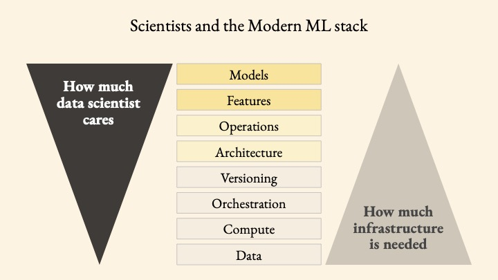

**If you're taking this tutorial at a conference, please pull the repository 24 hours before the tutorial begins to make sure to have the most recent version!**

# full-stack-ML-metaflow-tutorial


One of the key questions in modern data science and machine learning, for businesses and practitioners alike, is how do you move machine learning projects from prototype and experiment to production as a repeatable process. In this workshop, we present an introduction to the landscape of production-grade tools, techniques, and workflows that bridge the gap between laptop data science and production ML workflows.


Also, note that when we say we're teaching "Full Stack Machine Learning", we are not advocating for the existence of "Full Stack Data Scientists"! Rather, our goals lay in teaching which layers of the modern data stack data scientists need to be focusing on, while having (relatively) easy access to key infrastructural layers:




## Prerequisites

* programming fundamentals and the basics of the Python programming language (e.g., variables, for loops);
* a bit about the PyData stack: `numpy`, `pandas`, `scikit-learn`, for example;
* a bit about Jupyter Notebooks and Jupyter Lab;
* your way around the terminal/shell.


**However, we have always found that the most important and beneficial prerequisite is a will to learn new things so if you have this quality, you'll definitely get something out of this workshop.**

## Getting set up computationally

### 1. Clone the repository

To get set up for this live coding session, clone this repository. You can do so by executing the following in your terminal:

```
git clone https://github.com/outerbounds/full-stack-ML-metaflow-tutorial
```

Alternatively, you can download the zip file of the repository at the top of the main page of the repository. If you prefer not to use git or don't have experience with it, this a good option.

### 2. Download Anaconda (if you haven't already)

If you do not already have the [Anaconda distribution](https://www.anaconda.com/download/) of Python 3, go get it.

### 3. Create your conda environment for this session

Navigate to the relevant directory `full-stack-ML-metaflow-tutorial` and install required packages in a new conda environment:

```
conda env create -f env.yml
```

This will create a new environment called full-stack-ML-metaflow-tutorial. To activate the environment on OSX/Linux, execute

```
source activate full-stack-metaflow
```

If you're using Windows, please follow the instructions under Metaflow Windows Support [here](https://docs.metaflow.org/v/r/getting-started/install#windows-support): Metaflow currently doesn't offer native support for Windows. However, if you are using Windows 10, then you can use WSL (Windows Subsystem for Linux) to install Metaflow.


### 4. Open Jupyter Lab

In the terminal, execute `jupyter lab`.

Then open the notebook `1-Laptop-ML.ipynb` and we're ready to get coding. Enjoy.


## Session Outline

- Lesson 1: Laptop Machine Learning (the refresher)

This lesson will be a refresher on laptop machine learning, that is, when you’re using local compute resources, not working on the cloud: using the PyData stack (packages such as NumPy, pandas, and scikit-learn) to do basic forms of prediction and inference locally. We will also cover common pitfalls and gotchas, which motivate the next lessons.


- Lesson 2: Machine learning workflows and DAGs

This lesson will focus on building local machine learning workflows using Metaflow, although the high-level concepts taught will be applicable to any workflow orchestrator. Attendees will get a feel for writing flows and DAGs to define the steps in their workflows. We’ll also use DAG cards to visualize our ML workflows. This lesson will be local computation and in the next lesson, we’ll burst to the cloud.

We'll introduce the framework Metaflow, which allows data scientists to focus on the top layers of the ML stack, while having access to the infrastructural layers.


- Lesson 3: Bursting to the Cloud

In this lesson, we’ll see how we can move ML steps or entire workflows to the cloud from the comfort of our own IDE. In this case, we’ll be using AWS Batch compute resources, but the techniques are generalizable. 

- Lesson 4 (optional and time permitting): Integrating other tools into your ML pipelines


We’ll also see how to begin integrating other tools into our pipelines, such as dbt for data transformation, great expectations for data validation, Weights & Biases for experiment tracking, and Amazon Sagemaker for model deployment. Once again, the intention is not to tie us to any of these tools, but to use them to illustrate various aspects of the ML stack and to develop a workflow in which they can easily be switched out for other tools, depending on where you work and who you’re collaborating with.

To be clear, lessons 1-3 above get you far! As your projects mature, the more advanced topics in Lesson 4 become relevant. 


